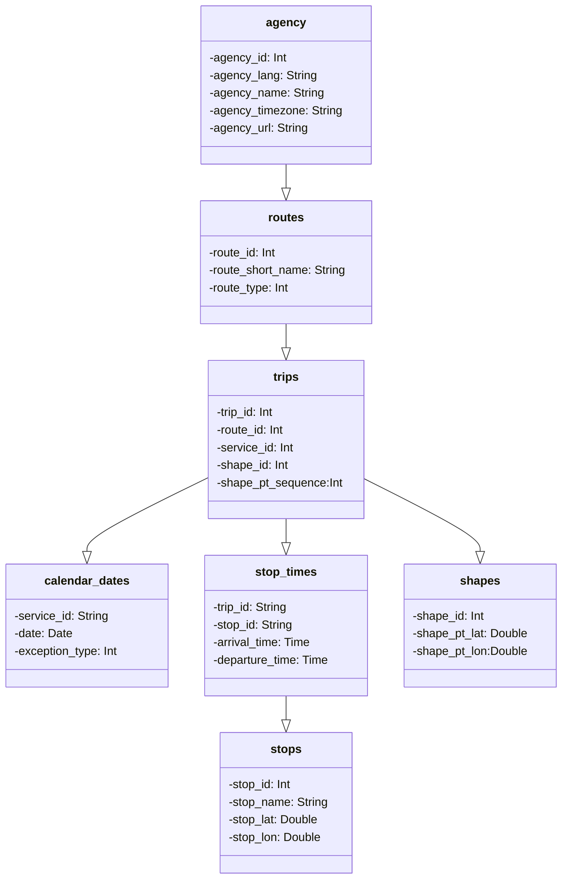

# gtfs_neo4j
Simple project for setting up [GTFS](https://gtfs.org/) in a neo4j database.

## What is GTFS-files?
GTFS stands for General Transit Feed Specification. It is a set of open standards that define formats for public transportation schedules and associated geographic information. GTFS allows public transportation agencies to share their transit data in a standardized way, making it easier for developers to create applications and services that provide information about public transportation routes, schedules, and real-time updates. This data format typically includes information about stops, routes, schedules, and fares, and it is widely used for developing transit-related applications such as trip planners and mobile apps.

### GTFS-model

This is a simplified model of GTFS.

## Data
All data files are in csv-format and downloaded from [Trafiklab.se](https://www.trafiklab.se/) (license CC0-1.0). It's the regional SJ-dataset. It contains only railroad traffic for trains where SJ (Statens Järnvägar) is railway undertaker.

## Cypher
The file /queries/cypher.txt contains cypher for ingesting all relevant data into nodes and relationships between them.

## Setup
1. Create a new neo4j database. The dataset is suitable for a free neo4j-instance in [AuraDB](https://neo4j.com/cloud/platform/aura-graph-database/)
2. Run /queries/cypher.txt

